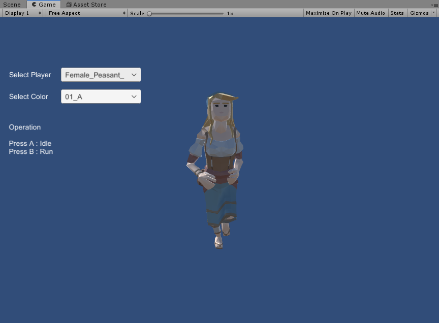

# CharacterDemo

## 1. 运行效果




## 2. 知识点

- 使用ScriptObject，作为配置文件
- 编辑器批量修改Prefab
- 模型：若干低模的模型，有若干材质球可以换，来实现换肤
- 动作：用了一个动作包里的动作，使用的是In-Place动作，不勾选Apply Root Mottion（否则位置还会有轻微的变化）

## 3. 代码结构

### Player

- CharacterData

  记录所有角色的Prefab

- Player

  挂在每个角色的GameObject下，负责访问SkinMeshRender等

- PlayerUtil

  离线工具，批量创建修改角色的Prefab上的Player脚本

- PlayerFactory

  负责创建角色，拥有缓存功能

### Camera

- CameraControl

  摄像机控制

### Dialog

- DlgCreateChar

  创建角色界面

工具类

- ScriptableObject

  ```c#
  [CreateAssetMenu(menuName = "MyAssets/CharacterData")]
  public class CharacterData : ScriptableObject
  {
      public GameObject[] m_charPrefabs;
      public Material[] m_charMats;
      public AnimatorController m_animatorController;
  }
  ```

- Prefab处理

  ```c#
  /*
   * 批量设置修改Player.cs脚本
   */
  public class PlayerUtil : MonoBehaviour
  {
      public CharacterData m_charData;

      public void SetPlayerScript()
      {
          for (int i = 0; i < m_charData.m_charPrefabs.Length; i++)
          {
              // create player script
              GameObject prefab = m_charData.m_charPrefabs[i];
              Player player = prefab.GetComponent<Player>();
              if (player == null)
              {
                  player = prefab.AddComponent<Player>();
              }

              // fill content of player script
              player.m_charData = m_charData;
              player.m_skinRender = prefab.GetComponentInChildren<SkinnedMeshRenderer>();
              player.m_spine = prefab.transform.Find("Root/Hips/Spine_01");
              player.m_charIndex = i;

              // create animator script
              Animator animator = prefab.GetComponent<Animator>();
              if (animator == null)
              {
                  animator = prefab.AddComponent<Animator>();
              }

              // fill content of animator script
              animator.runtimeAnimatorController = m_charData.m_animatorController;
              animator.applyRootMotion = false;
              // fill content of player script
              player.m_animator = animator;

              // save prefab
              UnityEditor.PrefabUtility.SavePrefabAsset(prefab);
          }
          Debug.Log("CreatePlayerScript: " + m_charData.m_charPrefabs.Length + " character prefab is processed.");
      }
  }
  ```

